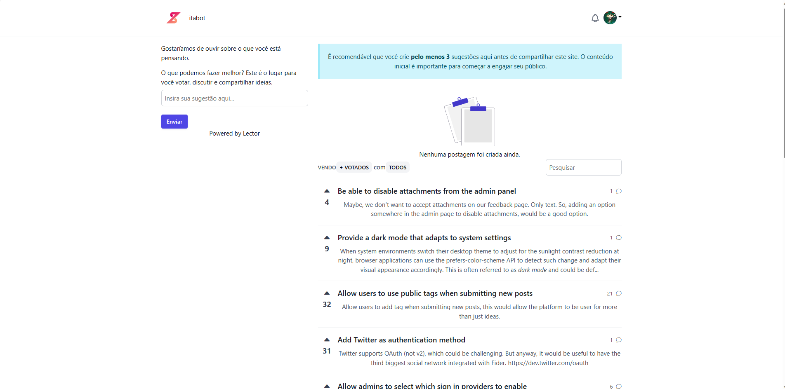

# Projeto ForumZita - HTML, CSS e JavaScript

## Descrição

Este é um projeto template simples para o ForumZita.

## Tecnologias Utilizadas

- HTML5
- CSS3
- JavaScript (ES6+)

## Funcionalidades

- Estrutura básica de arquivos para desenvolvimento web
- Exemplos de uso de HTML, CSS e JavaScript

## Contribuições

Contribuições são bem-vindas! Sinta-se à vontade para abrir issues ou pull requests.

## Autor

[LucasEduardo](https://github.com/LucasEduardo122) - Desenvolvedor Web